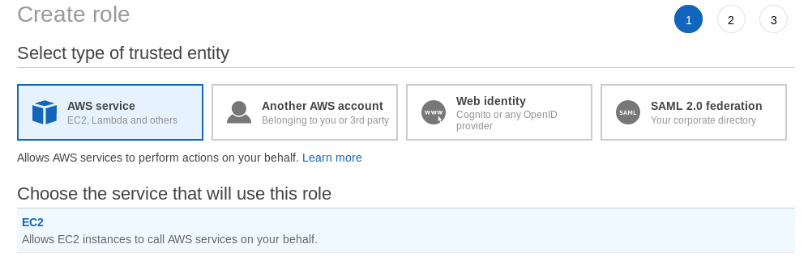
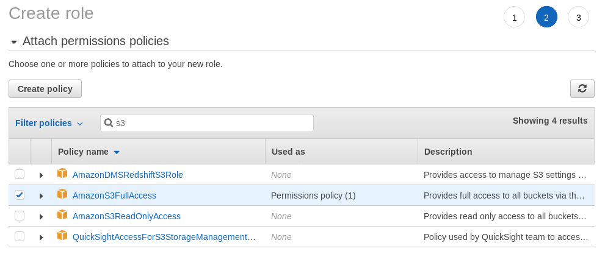
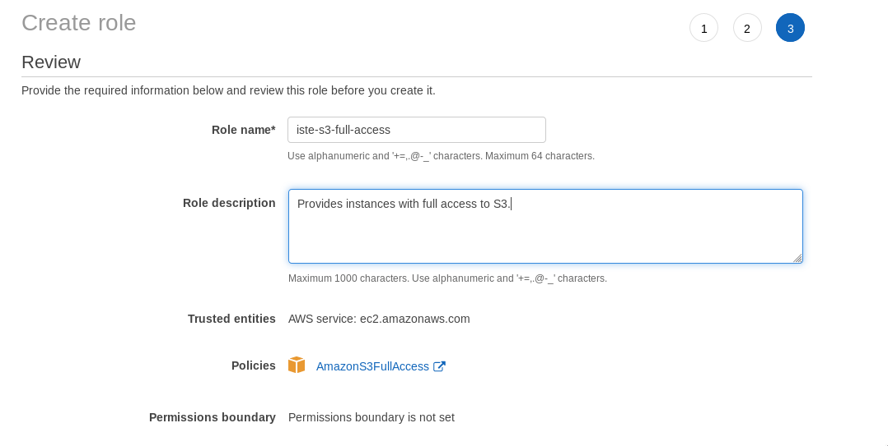
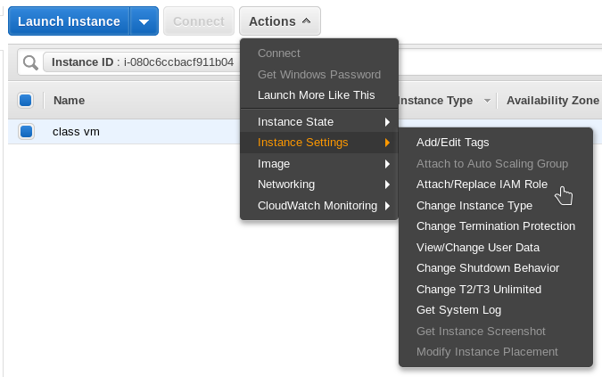
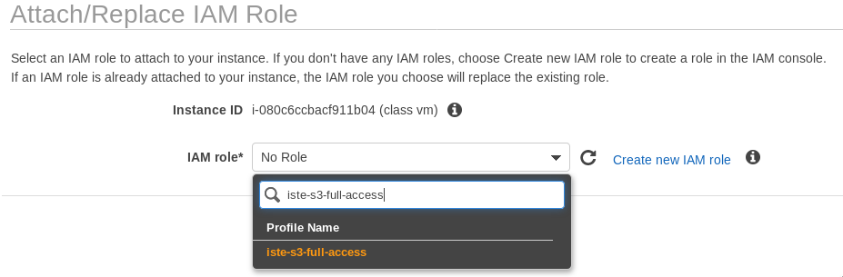

# Granting access to S3 for your EC2 instance

## Overview

This course uses the AWS Simple Storage Service (S3) to store and retrieve backups of the Oracle database. Your EC2 instance must have the ability to read from and write to your S3 buckets. There are a variety of ways to accomplish this. For example, we could store a secret access key directly on the instance. This approach can be potentially dangerous, as it would expose your entire account if your EC2 instance were broken into. Even if we restricted the power of this API key, it is still inconvenient to manually harcode a key into your instance.

Instead, we can create a role and assign that role to an entire EC2 instance. The instance (and scripts running inside it) will automatically receive all privileges granted by the role. This entirely removes the need to manage a separate access key, and we no longer have to store it insecurely in the instance. The instructions below explain this process.

## Create a role

First, we need to create a role with the appropriate permissions. Perform the following:

1. Navigate to **Services > IAM** in the AWS Dashboard
   * If you can't find IAM, you can use the search bar on the services screen.
2. Select **Role** and click **Create role**
3. Select **AWS service** and **EC2** and click **Next**

4. Search for "s3", select **AmazonS3FullAccess**, and click **Next**
   * Full access is fine for our purposes. Normally, you would further restrict the role and even define access control on the individual S3 bucket. Such configuration is beyond the scope of this lab and course.

5. Provide a descriptive name and useful description for your new role and click **Create Role** Be sure to write down or remember the role name.

## Attaching the role

Now that the role has been created, we need to attach it to the EC2 instance. Perform the following:

1. Navigate to **Services > IAM** in the AWS Dashboard
2. Select your instance and choose **Actions > Instance Settings > Attach/Replace IAM Role**

3. Select the role that you created in the previous step and click **Apply**

